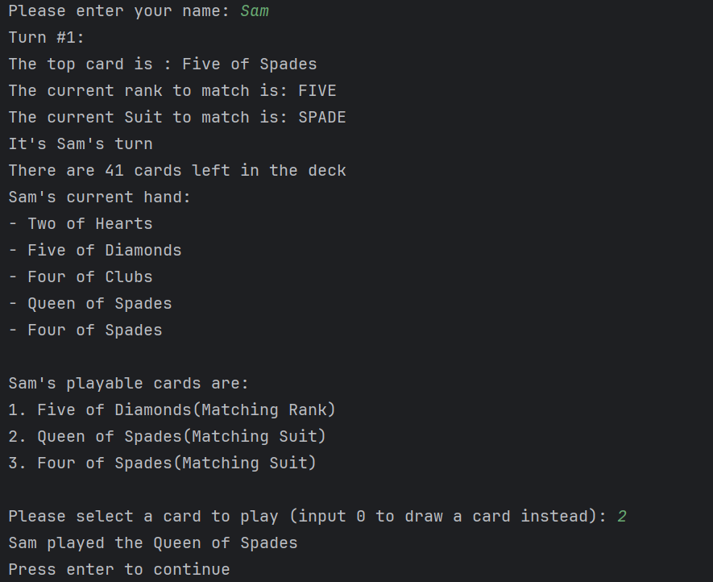

# Introduction
***

This project was created as part of my Object-Oriented Development Class.
The project is a simplified version of the Crazy Eight Card Game.
The rules are simple: 
- Each user has a **hand** of cards that they must discard by matching their cards' **rank** or **suit** with the **discard pile**.
- Each turn, the player may choose between **playing** or **drawing** a card.
- If the player cannot discard a card, then they must draw a card which they can choose to play if it matches the discard pile.
- Cards of rank 8 are referred to as **Crazy Eight Cards**. When a user plays one, they can select the suit that they want to match in the next turn. 
- The first player to run out of cards wins. If the deck runs out of cards, then the player with the least amount of cards wins. 
- If both players have the same amount of cards then the game ends in a tie.

## Key Concepts
***
This project is meant to demonstrate the following concepts:
- Designing around abstractions instead of concrete implementations
- Using interfaces to define contracts, and abstract base classes to share behavior
- Polymorphism through collections of base types
- The use of encapsulation to protect internal states

## How to Run
***
There are 2 main ways to run this program:
- From the Command Line:
  - What You'll Need:
    - Java 21 or higher
    - Maven
  - Instructions to Build and Run the Program:
    1. Clone the repository using `git clone https://github.com/copelansam/my-crazy-eights`
    2. Navigate to the root directory of this application
    3. Build the application by running `mvn clean package` from the CLI
    4. Execute the application by running `java -jar target/my-crazy-eights-1.0-SNAPSHOT.jar` from the CLI
    5. The program should open itself in your CLI where you can play around with it.
- With a Docker Daemon:
  - What You'll Need:
    - Docker
  - Instructions To Build and Run the Program:
    1. Clone the repository using `git clone https://github.com/copelansam/my-crazy-eights`
    2. Ensure you have docker open
    3. Move to the root directory of the application
    4. From the CLI, run `docker build -t crazy8s .` to build the docker image
    5. Then run `docker run -it crazy8s`

A screenshot of the game: 